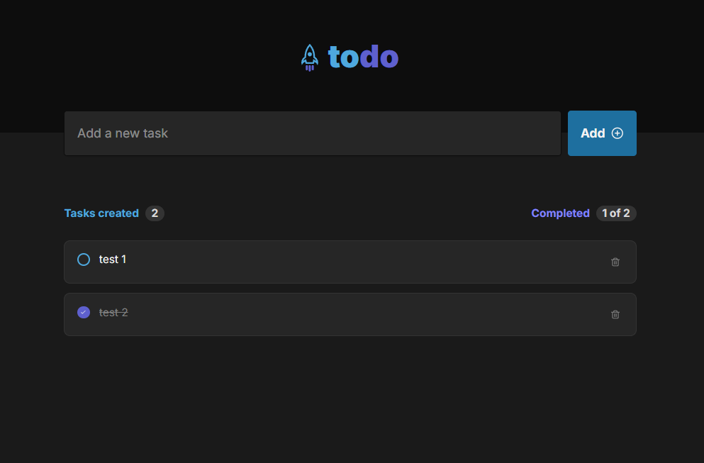

# 📝 Todo List

A clean and functional Todo List app built with React, TypeScript, Tailwind CSS, and Framer Motion. Add, complete, and delete tasks with smooth animations and a modern UI. Your tasks are saved in the browser using localStorage.

## 🚀 Live Demo

Check out the live version: https://todo-list.vercel.app

## ✨ Features

✅ Add new tasks

✅ Mark tasks as completed

✅ Delete tasks individually

✅ Data persistence with localStorage

✅ Smooth animations with Framer Motion

✅ Responsive and accessible UI

## 📸 Screenshots

Example:

## 🛠️ Built With

- React
- TypeScript
- Tailwind CSS
- Framer Motion
- Lucide Icons

## 📦 Getting Started

Follow the steps below to run the project locally:

1. Clone the repository
   `git clone https://github.com/Valdiberto/todo-list.git`

2. Navigate into the project folder
   `cd todo-list`

3. Install dependencies
   `npm install`

4. Start the development server
   `npm run dev`
   Open your browser and go to http://localhost:3000

## 🧪 Tests

This project does not currently include automated tests. Feel free to contribute with tests or improvements!

## 📁 Deployment

This project is ready for deployment with Vercel. Just connect your GitHub repo and deploy — no extra config needed.

## 📄 License

This project is licensed under the MIT License.

## 🙋 Author

Made with 💻 by Valdiberto
